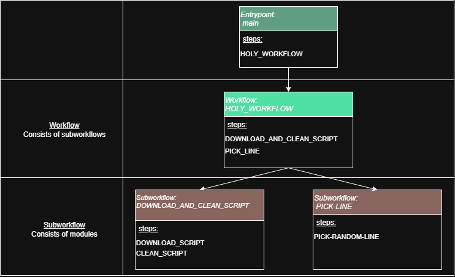

# Understanding Nextflow – Illustrated with HolyQuote

## Goal of this Explanation
This explanantion aims to introcude the essential ideas and principles of [Nextflow](https://www.nextflow.io/docs/latest/index.html) with the help of this fun little project called HolyQuote.

## Nextflow
Nextflow is a tool that makes it easy to build and run automated workflows. It handles parallel processing across computers or clouds, and uses containers to keep everything consistent and reproducible. Check the whole documentation [here](https://nextflow.io/docs/latest/index.html)

## HolyQuote
HolyQuote is a toy project that 
1. Downloads a script from Monty Python and the Holy Grail
2. Cleans it up
3. Extract a random quote

## Structure of a Nextflow Project

A  Nextflow project typically includes:
- `main.nf`: The entry point of the workflow
- `workflows`: Contains the sequence of steps for all major pipelines in the project
- `subworkflows`: Reusable process chains
- `modules`: Individual execution units
- `bin`: Scripts (e.g. Bash or Python) executed inside processes
- `nextflow.config`: Central configuration fileto defines profiles, default parameters, and global settings

In HolyQuote this results in this structure:
```
HOLYQUOTES/
├── bin/
│   ├── clean_html_script.py
│   ├── download_holy_script.sh
│   └── pick_random_line.py
├── modules/
│   └── scripts.nf
├── subworkflows/
│   ├── get_script.nf
│   └── pick_random_line.nf
├── workflows 
│   └──holy_grail_workflow.nf
├── main.nf
└── nextflow.config
```
Here a simple visualisation of the Workflows and Subworkflows:




## Examples nf-files

To get more familiar with Nextflow Syntax, let's look at a few examples:

### Config File
```conf
nextflow.enable.dsl = 2

profiles {
  docker {
    process {
      executor = 'local'
      container = 'python:3.10-slim'
    }
  }
}


params {
  holy_script_url = "https://www.sacred-texts.com/neu/mphg/mphg.htm#Scene%2035"
  file_prefix = "holy_script"
  min_words = 20
  quote_file_name="quote"
}
```

Explained step-by-step:
- `nextflow.enable.dsl = 2`: Specifies which version of the Domain Specific Language
- `profiles {...`: Defines the environment to run the scripts
- `params`: Defines parameters which can later be accessed

### Workflow: HOLY_WORKFLOW
```nextflow
#!/usr/bin/env nextflow

nextflow.enable.dsl = 2

include { DOWNLOAD_AND_CLEAN_SCRIPT } from '../subworkflows/get_script.nf'
include { PICK_LINE_FROM_CLEANED_SCRIPT as PICK_LINE } from '../subworkflows/pick_random_line.nf'

workflow HOLY_WORKFLOW {
    script_path = DOWNLOAD_AND_CLEAN_SCRIPT(params.holy_script_url, params.file_prefix)
    quote = PICK_LINE(script_path, params.quote_file_name, params.min_words)
    quote.view()
}
```

Explained step-by-step:
- `include` lines: Basically "importing" the subworkflow in the current workflow
- `params.holy_script_url` : Gets the paramter from the configs
- `quote.view()`: Simply prints the variable `quote` 

### Subworkflow: DOWNLOAD_AND_CLEAN_SCRIPT

```nextflow
#!/usr/bin/env nextflow

nextflow.enable.dsl = 2

include { DOWNLOAD_SCRIPT ; CLEAN_SCRIPT } from "../modules/scripts.nf"

workflow DOWNLOAD_AND_CLEAN_SCRIPT {
    take:
    holy_script_url
    holy_file_prefix

    main:
    downloaded = DOWNLOAD_SCRIPT(holy_script_url, holy_file_prefix)
    cleaned = CLEAN_SCRIPT(downloaded, holy_file_prefix)

    emit:
    cleaned
}
```
Explained step-by-step:
- `take`: Defines input variable
- `main`: Defines the sequence of processes executed in this subworkflow
- `emit`: Defines ouput, in this case a path to the prepared script

### Module: DOWNLOAD_SCRIPT in modules/scripts 

```nextflow
process DOWNLOAD_SCRIPT {
    tag "${script_url}"
    publishDir "results/download"

    input:
    val script_url
    val html_script_name

    output:
    path "${html_script_name}.html"

    script:
    """
    bash ${baseDir}/bin/download_holy_script.sh "${script_url}" "${html_script_name}.html"
    """
}
```
Explained step-by-step:
- `tag`: Describes a "ID" for the procces, important when called  multiple times
- `publishDir`: Defines where the ouput file should be safed
- `script`: Defines a script that will be executed, here we execute a bash script (could also be a python script) that is saved in the `bin` folder 

## Nextflow Execution
To execute a Nextflow script simply use:
```bash
nextflow run <script>
```
But if the script is called `main.nf`, the dir is enough:
```bash
nextflow run .
```

### Logs
Nextflow logs everything in `.nextflow.log` in the cwd. It always kepps the last 10 logs, starting with the latest `.nextflow.log` up to the oldest `.nextflow.log.9`. But when running Nextflow each Procces is associated with a hash code. This is printed in the std.out like this:
```
[07/434a71] HOLY_WORKFLOW:DOWNLOAD_AND_CLEAN_SCRIPT:DOWNLOAD_SCRIPT (https://www.sacred-texts.com/neu/mphg/mphg.htm#Scene%2035) [100%] 1 of 1 ✔
[59/5011e1] HOLY_WORKFLOW:DOWNLOAD_AND_CLEAN_SCRIPT:CLEAN_SCRIPT (holy_script.html)                                             [100%] 1 of 1 ✔
[06/d9287b] HOLY_WORKFLOW:PICK_LINE:PICK_RANDOM_LINE (holy_script.txt)                                                          [100%] 1 of 1 ✔
```
the hashcode for the tasks are the `07/434a71`, `59/5011e1` and `06/d9287b` respectively. If you now check the `work` folder in your cwd, you will notice folders named like the hashcode. Here you can finde more detailed logs for each step. Furthermore they can be used to use already existing results for the next execution of the pipeline, by setting the `--resume` flag in the `run` command.

## Extra: nf-core

[nf-core](https://nf-co.re/) is a collection of pipelines built with nextflow that follow a certain template. For set up and more information check their [docs](https://nf-co.re/docs/).

### Use nf-core
To create a new nf-core pipeline you just need the `create` command:
```bash
nf-core pipelines create
```

Now nf-core allows you two things:
1. Run a predfined pipeline, which can be found [here](https://nf-co.re/pipelines) or with the `nf-core pipelines list` command. After choosing a pipeline it can be run with:
    ```
    nf-core pipelines launch <pipeline>
    ```
2. Install modules to help your nf-core project. These can be found [here](https://nf-co.re/modules).
    ```bash
    nf-core modules install <module>
    ```
    The module can then be found in `modules/nf-core` and at the end of the installation you will finde a message like this to tell you how ti include it:
    ```nextflow
    include { <module> } from '../modules/nf-core/<module>/main'
    ```
### nf-core configs
In addition to the `nextflow.config` *nf-core* uses additional conig files stored in the `conf` dir:
- `base.config`: Defines default process settings and resource allocations, like memory and maximum time.
- `modules.config`: Defines per module options and publishing paths
  - important argument `ext.args`: Add more arguments to the execution of modules. Fo example changing FASTQC to quiet mode:
      ```
      process {
        withName: FASTQC {
            ext.args = '--quiet'
        }
      }
      ```
- `test.config` and `test_full.config` define tests for your pipeline